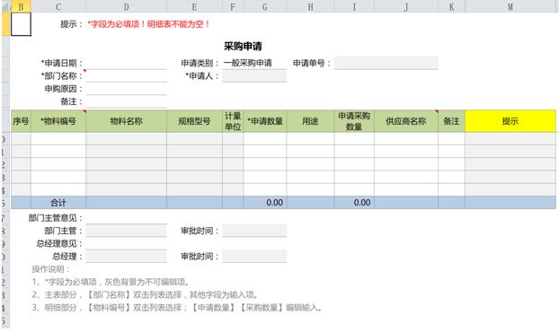
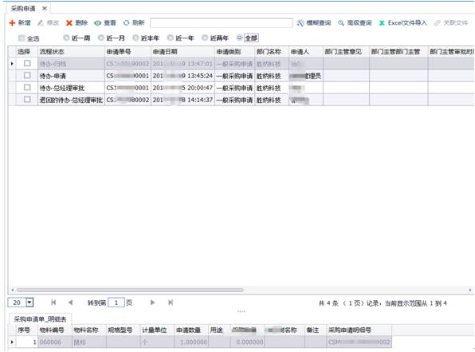
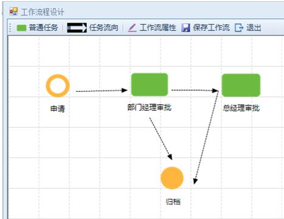
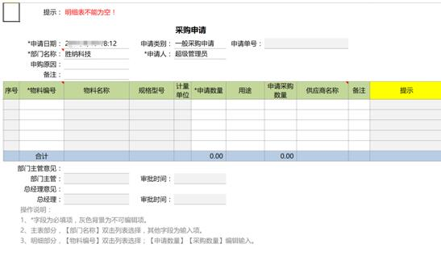

# 1.2 用NxCells构建信息系统
## 1.2.1 组织、角色、用户
信息系统的目的是，“让合适的人，在合适的时候，得到合适的信息”。使用这个系统的通常不是一个人，而是组织内各个岗位上的人，他们有不同的职责和对信息的访问权限。在NxCells中，用过“系统”模块，可以很方便地定义系统中的组织机构、角色、用户。其中组织机构就是我们通常说的部门划分，角色代表不同的职能，用户是能实际登录到系统，进行操作的人。每个用户属于不同的部门，拥有不同的角色，从而具有不同的信息访问权限。
## 1.2.2 信息系统由一个个“模板”组成
* 一个信息系统中包括组织内的各种各类信息，它们有业务单据、台账、有统计报表等。这些信息需要集中存储、多人共享、合理流动、综合运用。

* 在NxCells中，所有各类需要管理的信息统称为“模板”，“模板”是NxCells的基本概念，一个信息系统就是由一个个模板组成。简单地说，“模板=表样+填表规定”，针对每类需要管理的信息，我们都设计一个“模板”，用来规范这一类信息如何填报、如何存储、如何在不同岗位间流转、如何计算、如何与其它信息关联等。
例如，针对采购申请，我们定义一个“采购申请”模板，它的表样如下：

* 有了模板的表样，相关有权限的用户就可以按照此表样输入采购申请的信息，集中存储到系统的数据库中。如下图：

针对一个模板，除了表样之外，我们还可以规定：

- 模板的权限。
例如，采购申请人员可以填报“采购申请”，但是每个申请人员只能看到自己填的采购申请，看不到别人填的采购申请；部门经理可以看到本部门人员填的采购申请；总经理可以看到全部采购申请等。

- 模板的在不同岗位间的流转（工作流）。
例如，采购申请模板首先由采购申请人员填写，然后传递给其部门经理审批，最后传递给总经理审批，如果审批不通过就此终止。NxCells采用图形化的方式来定义流程，如下图：

- 填报模板时的输入要求（数据规范）
例如：“申请单号”由系统自动产生，“申请人”默认为当前登录人的姓名，不能随意改；“部门名称”从弹出列表中选择，不能随便输入等。

- 这个模板和其它模板之间的数据引用关系（表间公式）
例如：输入采购申请的时候，部门名称根据申请人自动带出，而申请人和部门名称之间的对应关系，来自于另一个“部门信息”模板上。

## 1.2.3 用人们熟悉的Excel界面或类Excel界面来操作
* 如前所述，一个信息系统由一个个模板组成，用NxCells构建信息系统的过程，就是定义模板的过程。模板的定义从画表样开始，表样怎么画呢？用Excel来画！

* Excel是企事业单位中十分常用的信息处理工具，人们很熟悉Excel的使用，也习惯于用Excel处理自己的日常工作。NxCells用Excel作为主要的操作界面，定义模板表样，就是在Excel文件上画好模板的格式，填报数据，就像操作一个普通的Excel文件一样。如下图：

* 用NxCells构建出来的信息系统，因为很多操作都可以通过Excel界面来完成，人们没有陌生感，操作很容易掌握，每个功能的界面（模板）看起来和自己日常工作中所用的Excel表格又很相似，所以很快就能上手，这样无形中化解了企业信息化过程中通常会遇到的风险之一：最终用户对于新系统的学习成本以及由此而来的不适应和抵触，从而大大降低信息系统的实施难度，提高信息化的成功率。

## 1.2.4 NxCells≠Excel
初次接触NxCells的用户，在没有具体了解之前，往往会问到这样一个问题：NxCells和Excel电子表格有什么区别？它是Excel的补充吗？是Excel的替代品吗？都不是，除了用Excel电子表格作为客户端操作界面之外，NxCells和Excel电子表格软件有巨大差异，它们是完全不同的两类软件。另外，利用NxCells设计的模板可以不依赖Excel环境而独立运行。

 * 作用和目的不同
NxCells的目的是构建企业信息系统。电子表格Excel是供个人或群组使用的桌面工具。

 * 功能不同
NxCells提供一个信息系统需要具备的各种功能，包括：组织、角色、用户的定义；表单的设计、数据字典的定义和数据库表的创建；工作流的定义和运行；数据统计方式的定义和自动执行；WEB操作方式；移动应用；消息接口；电子邮件接口；与其它信息系统的数据集成等。

 * 对信息的管理方式不同
NxCells管理的所有信息集中存储在数据库中，Excel上的数据存储在Excel文件中。

 * 操作方式不同
NxCells的客户端可以通过电子表格界面访问，可以通过浏览器访问，还可以通过手机端访问。

 * 系统架构不同
NxCells采用三层架构，安装时需要分别安装服务端和客户端。具体内容我们在后面的章节详述。

## 1.2.5	NxCells让用户自主信息化进程
* NxCells的基本设计理念是“用户自主”，不依赖软件厂商，也不迷信管理咨询顾问，让企事业单位的管理者和业务人员成为实现企业信息化的主导力量。

* 首先，需求自主。采用NxCells来设计系统，每个功能（模板）都是根据企业实际业务状况定义出来的，最大程度地保证了系统符合业务需求。这一点，和购买现成的套装软件有极大地不同。

* 其次，人员自主。NxCells是面向最终用户的，使用它的人就是企业自身的管理人员和业务骨干，设计系统的过程就是实际工作中设计管理表格、规划流程、建立管理制度的过程的自然延伸，不需要写一行代码，也不需要掌握过多的计算机专业知识。这一点，和无论是请软件公司做开发还是企业自身招聘计算机专业人员做开发都有极大地不同。企业不必为招不来或留不住计算机人才而发愁，因为信息化工作的主体，已经不是必须接受专门训练的技术人员，而是企业的业务人员和管理者。

* 第三，过程自主。前面我们谈到过，用NxCells构建的信息系统，由一个“模板”组成，一个模板就是我们要管理的一种单据、一个流程、一类报表。企业信息化可以不是一个宏大的目标或几阶段规划，而是化为日常工作中的点滴努力：先把一个单据和流程做进系统，用起来，改进，再做第二个、第三个，...，系统渐进地发展起来，流程的优化和改进也可以和风细雨地进行，在无形中完成运营方式的转变和管理能力的提升。

* 第四、维护自主。信息化是一个持续的过程，一个真正成功的信息系统需要能跟得上企业发展的步伐，在未来的岁月里，不断改进和完善。从技术上说，NxCells简单易用，快速定制的构建方式使得信息系统能够很好地应对需求的变化----改变容易、调整迅速；从应用模式上说，因为系统的构建由企业自己的人员完成，企业依靠自身力量就能很好地完成系统维护的工作。
