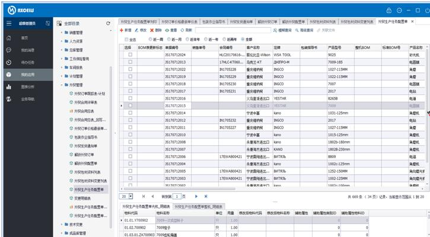

# 1.3 基于NxCells的信息系统架构
基于NxCells的信息系统，分为三个层次，如下图所示。最底层是基础软件，包括操作系统、数据库、电子表格软件（也可以不依赖）等，需要用户自行购买。
在基础软件层之上，就是NxCells，它提供了构建一个信息系统的所必须的各种功能。
基于NxCells之上，就是我们自己构建的各种应用系统。我们把企业的实际业务和管理需求，做成一个个模板，固化到系统中，并且随着业务的发展，不断优化和发展。如下图：
 
