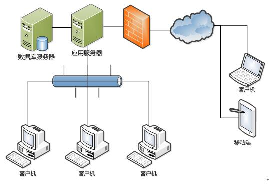
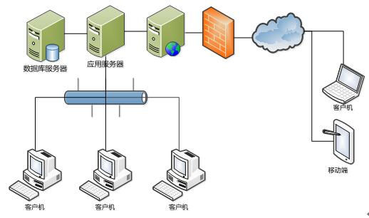

# 2.1 安装概述
## 2.1.1 部署方式
NxCells是一个网络应用系统。我们要选择一台计算机作为“服务器”，其它的计算机作为“客户机”。数据统一保存在服务器上。

这里所说“服务器”是一个软件的概念，说某台计算机是服务器，不是说它的硬件特征有什么特殊，而是说它在一套网络应用系统中所起的“作用”与其它的计算机不一样。对NxCells而言，在用作服务器的那台计算机上安装有数据库和服务程序，用户通过网络上的其它计算机（客户机）登录到服务器，从服务器上的数据库中获取信息，进行各种操作，最终的结果再保存到数据库中去，通过这种方式实现了信息的共享。

实际在企业中部署的时候，“服务器”可以不只是一台，而是几台，我们可以把数据库、服务程序和Web服务分别安装在不同的机器上，以满足更高的安全性和性能方面的要求。

以下列举几种可能的部署方式：

* 1) 只用一台服务器，如下图：

* 2) 数据库服务器和应用服务器分离，如下图：

* 3) 数据库服务器、应用服务器、web服务器均分离，如下图：

在安装的时候，我们要先安装服务器，再安装其它的客户机。

本章以最简单的部署方式，即一台服务器的部署方式为例，讲述服务器和客户机的安装过程，其它更复杂的部署方式另作讲解。

## 2.1.2 软硬件环境要求
* 软件环境要求

|项目|服务器要求|客户端要求|
|----|:--:|:--:|
|操作系统	|WIN2008 Server+|XP、VISTA、Win7/10|
|Windows组件|IIS / Microsoft .Net Framework 4.5|Microsoft .Net Framework 4.0|
|数据库	|MS SQL Server 2008+||
|应用软件|	MS Excel 2007+ / IE 8.0+|设计端MS Excel 2007+；运行端MS Excel 2003+(可选) / IE 8.0+，IE内核的其它浏览器，推荐Firefox浏览器|

备注：32位或64位的操作系统、数据库、Excel均支持。

* 硬件环境要求

|项目|服务器(最低)|服务器(推荐)|客户端(最低)|客户端(推荐)|
|----------|:--:|:--:|:--:|
|处理器|双核 2GHz	|Xeon E3 2GHz|单核 1.5GHz|Core I3 2GHz|
|内存|2G|32G|1G|4G|
|硬盘|HDD 100GB|SSD 200GB+HDD 1T|HDD 60GB|SSD 60GB|
|网卡|百兆网卡|千兆网卡|百兆网卡|百兆网卡|	

## 2.1.3 下载安装包
NxCells的安装包可以从官网下载：http://www.NxCells.com
