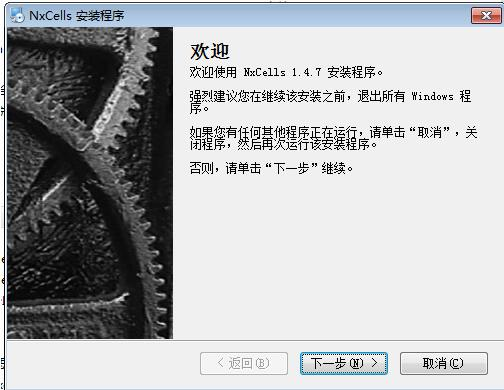
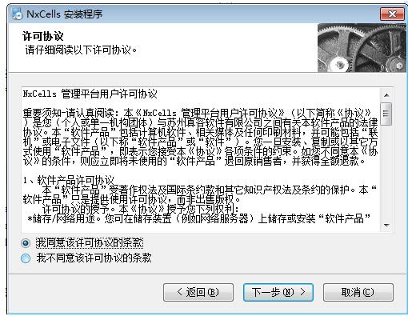
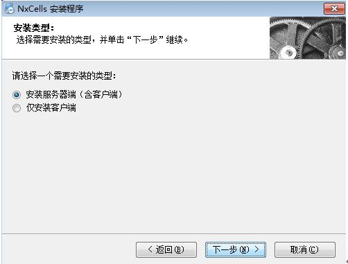
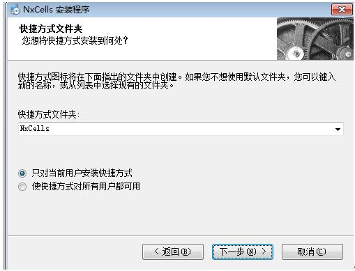
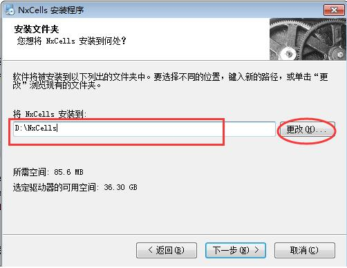
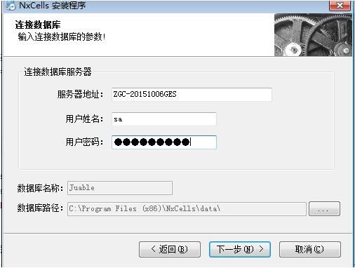
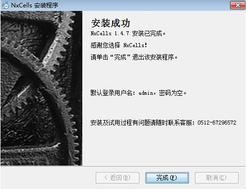

# 2.2 服务端安装
本节所述服务端安装为最简单的部署方式，即服务器只有一台机器，应用服务、数据库、Web服务等都安装在同一台机器上；其它部署方式下的服务端安装另作讲解。

1)	在解压后的安装程序文件夹中，右键以管理员身份运行NxCells-setup.exe，出“NxCells安装程序”对话框，按【下一步】
 

2)	出现“许可协议”对话框，选择同意许可协议，按【下一步】
 

3)	选择安装类型“安装服务器端”，按[下一步]
 

4)	选择快捷方式文件夹，按【下一步】
 

5)	选择要安装的路径，默认“D:\NxCells”，按【下一步】
 

6)	安装程序会自动获取本地服务器IP地址或主机名，请填入正确的用户名及密码，按【下一步】，会提示“正在连接数据库，请稍后…”，如果提示找不到数据库，请退出安装程序，然后先安装SQL Server2005及以上版本

 

7)	选择数据库的安装类型“安装全新数据库”，按【下一步】

8)	按【安装】，出现安装进度

9)	安装完成，点【完成】。

