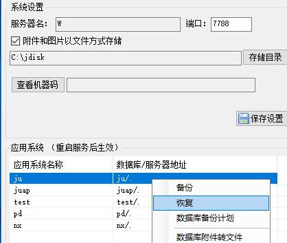

# 2.2 服务端安装
一般双击安装程序，一路【下一步】即可。
 
!> 两点需注意：

1. 新手选择数据库时要使用SQL Server2005及以上版本，不要使用精简版sql

2. 安装完成后，与ES不同的是需要手工还原server目录下的blank.bak备份。

## 脱坑拓展
?> @风神：聚表安装，我原来折腾过各种办法，对于精简版数据库是有要求的：端口必须为1433，服务器地址不能为服务器实名，不能用127.0.0.1，只能用localhost或者localhost\jsql2008，其他方式均失败；另外成功安装后，其实你会发现精简版库中根本没有安装成功自带的JUABLE数据库，但是丝毫不影响你新建其他帐套 