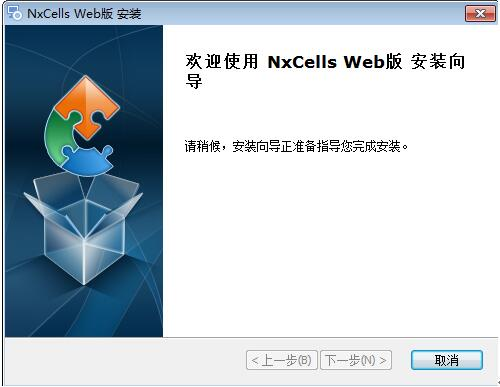
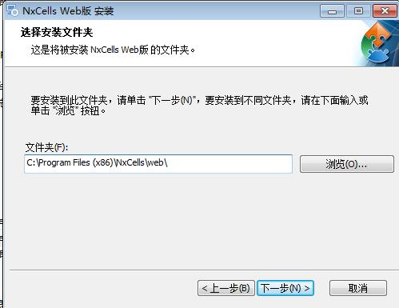
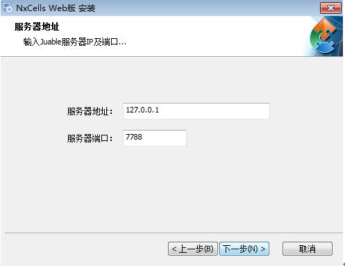
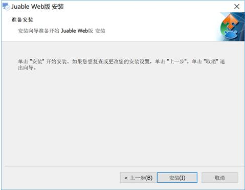
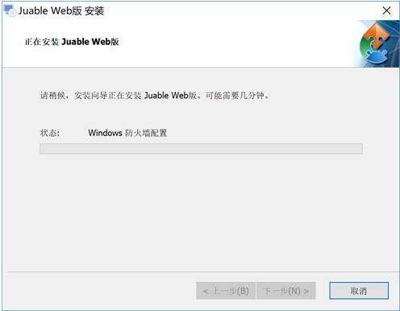
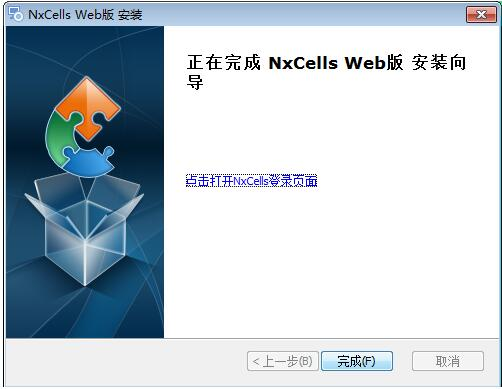

# 2.4 手机服务端的安装
如上节手机端的Web服务和应用服部署在同一台机器上，目前仅支持手动部署方式；其它部署方式另作讲解。

1)	首先官网地址www.nxcells.com下载NxCells-mobile.exe文件

2)	在解压后的安装程序文件夹中，右键以管理员身份运行NxCells-mobile.exe，出“NxCells Web版安装程序”对话框，按【下一步】
 

3)	选择要安装的路径，默认“C:\Program Files (x86)\NxCells\web\”，按【下一步】
 

4)	输入服务器地址与端口号，按【下一步】

5)	点【安装】
 

 
6)	安装完成，点【完成】

