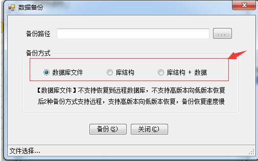

# 3.1 新增账套&备份

### 3.1.1 新增账套
!> 与ES不同，要先到数据库创建一个空库，然后配置该库，还原blank.bak。

### 3.1.2 备份

备份的三种方式：

1.	数据库文件，该种备份备份的是整个数据库。一般适用于同种版本的数据库之间恢复或者低版本恢复到高版本，不适用于高版本向低版本恢复数据。

2.	库结构，该种备份备份的只是数据库的库结构，不备份数据。往往适用于在备份库修改数据结构后，恢复到正式库。

3.	库结构+数据，该种备份往往适用于高版本向低版本数据库恢复还原数据。

> 一般示例库会采用第三种方式发布，例如`61库`。