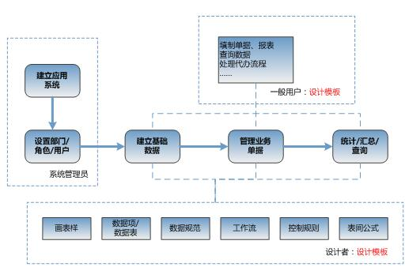

# 3.1 构建信息系统的流程
## 3.1.1 参与的人员
在利用NxCells实现信息化的过程中，有三类人员要参与其中。

第一类是系统管理员，他的责任是部署好企业的网络，在服务器和客户机上安装好NxCells软件、设置系统参数、建立应用系统、设置部门/角色/人员信息、备份和恢复数据库等。

第二类人员是应用系统设计者，他们通常是企业内的管理人员或业务骨干，非常了解本企业的业务流程和管理要求、清楚相关数据的来龙去脉，他们的主要任务是根据企业实际业务中用到的单/帐/表、业务流程和管理制度等，来设计表单模板，包括设计模板的格式、定义模板上的数据项、定义工作流、定义各模板之间数据互相引用的表间公式、定义模板操作的控制规则、设置模板的权限等，一个个的模板组成了信息系统。

第三类人员就是一般用户，他们根据设计者事先定义好的模板，进行数据填报、查询、统计、流程传递等。
很多情况下，设计者和系统管理员可以由同一人兼任。有条件的企业，还可以配备一名计算机和网络管理员，负责日常的网络维护、电脑维护、软件安装、服务器管理等工作。

## 3.1.2 构建流程
下图表示了用NxCells建立信息系统的过程。粗线箭头连成的主线表达了建立一个信息系统所要完成的任务。系统管理员建立应用系统，在其中设置部门、角色、用户等基本信息；随后将企业业务数据纳入信息化管理，包括建立基础数据、管理业务单据、完成统计/汇总/查询。设计者将基础数据、业务单据、统计报表等设计成模板，一般用户使用这些模板进行数据的填报、处理、查询、汇总等，数据统一存储在数据库中。

图中下部的虚线框表示了设计者在设计模板时可能进行的操作，包括是设计表样、定义数据项、定义表间公式、定义工作流、定义控制规则等，它们都是NxCells提供的具体功能，我们将在后续的章节中用实际的例子，由浅入深、由简单到复杂，逐步学会和精通。
 
