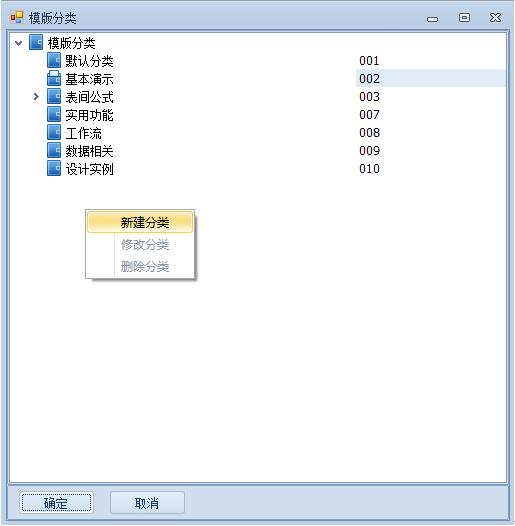

# 3.1 模板属性
设置模板基本信息及高级属性
	 

* 基本信息

【模板编号】必填，唯一，用于模板先后次序排序。  
【模板名称】必填，唯一，用于逻辑关系引用。  
【模板标题】用于`手机端表名`显示。  
【模板分类】弹出窗口选择（如果没有，则树形中选中某分类，`右键`新增或修改分类），如下图：
 

用于我的应用中左侧树形目录。

【手机分类】弹出窗口选择（如果没有，`右键`新增），应用于手机端，不支持多级。

* 高级属性

高级属性可根据实际需要设置，在此不做详细说明；【打开方式】选择spreadsheet运行时速度会更快，推荐这个设置。

2)	模板信息设置完毕后，点【下一步】按钮，选择要创建的表类型；

 
一般默认选择【自动创建表】。打开一张空白的Excel模板，然后点保存。

?> 拓展延伸：映射表，即相当于另一个表的映射。甲表映射乙表。甲表的A,B,C三个字段分别映射乙表的Q,W,E字段，那么甲表A,B,C的显示结果既是乙表的Q,W,E。可自行测试。

