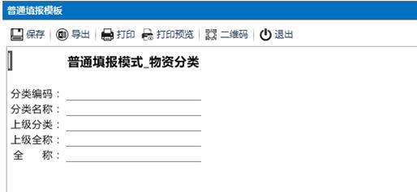

# 3.2 模板的概念
在前面的章节中，我们已经多次提到“模板”这个词。用NxCells构建的信息系统，由一个个的模板组成。构建信息系统的过程，就是制作“模板”的过程。在学习下面的具体操作之前，我们先来了解一下模板的概念。

## 3.2.1	什么是模板
简单地说，模板就是一个空白的表样。依照模板填充了具体的数据之后的表格，称为`表单`。例如，下面的图（1）是一个`采购申请`模板。图（2）是依照采购申请模板填报的若干表单。
 

图（1）
 

图（2）

## 3.2.2 模板的设计者和使用者
`模板`并不是一个抽象的名词，在一个管理有序的组织中，作为信息载体的各种单据、表格绝大多数都有规定的格式、规定的填写、传递、归档，这些都是现实中的“模板”。模板本身就是管理要求的体现，所以`设计`模板的通常是组织中承担管理职能的个人或岗位，是规则的制定者；`使用`模板，也就是具体填写表单的，是各个业务岗位，是规则的执行者。

例如，在一个企业集团中，采购申请的格式及填写规定是由企管办统一制定（设计），而各分子公司的有采购需求的部门照章执行。那么采购申请模板的设计者就是企管办，而各分、子公司的需求部门是使用者。

在NxCells中，设计模板的是拥有`模板设计者`这个系统预定义角色的用户，其他的用户都是使用者。

## 3.2.3 模板=表样+填表规定
作为现实中管理要求的具体体现，“模板”所包含的内容不仅仅是表样，同时还包括相关的填表规定，如：

* 填写的项目的规定
哪些地方应该填数据、填什么类型的数据、哪些栏目是必填项等。在NxCells中，这类规定称为`数据项定义`。

* 填写的规范化要求
哪些栏目必须如何填写。比如，采购申请上的物料要规范，要保持和公司物料信息表中登记的名称一致，不能填简称等。在NxCells中，这类规定称为`数据规范`。

* 流转的规定
要经过哪些流转环节，每个环节由何人处理；审批通过了怎么做，没通过又怎么做等。在NxCells中，这类规定称为`工作流`。

* 增、删、改、查等表单控制的规定
在NxCells中，这类规定称为`控制规则`。

* 计算、统计方法的规定
在NxCells中，这类规定称为`表间公式`。

## 3.2.4 三种类型的模板
根据在一个信息系统中所起作用的不同，我们可以简单地把各种模板分成三类：基础数据类、业务单据类、台帐和统计报表类。

基础数据类的模板，如客户信息、产品信息、科目代码、成本项目等等，这类数据的特点是：日常变动较少、多部门共用、基本没有复杂的流转，建立一个信息系统，首先要把基础数据管起来。

业务单据类的模板，如订单、入库出库单、报销单、凭证等，在日常业务发生的时候产生。这类数据的特点是：种类多、数据量大、时效性强，流程性要求比较多，它直接关系到日常业务的顺利运转。是管理的重点，也是产生统计数据的基础。建立信息系统的时候，对业务单据要注重：

1)	重视和涵盖。有的企业只把注意力放在统计报表上，忽视对业务单据的管理。殊不知管好业务，才能提高执行力，统计数据才能真实而有意义。

2)	简化、自动化、规范化单据的录入工作。NxCells中提供了很多手段：如数据规范、自动执行的表间公式、支持条码输入等，可大大提高效率。

3)	注重流程的规范化。

台帐、统计报表类的模板，这类数据的特点是：

1)	它们自身很少产生新的信息，而是对已有数据的引用、加工、重现。

2)	时效性要求高，日报必须在几点以前出来、月报必须在几号前上报，早或晚都不合要求。

3)	经常变动。统计报表是用来为管理者提供决策依据的。经营环境的变化、突发事件的影响、管理人员的变动、个人喜好的不同，都可能随时随地提出各种不同的统计要求，导致统计人员的加班加点成为常态。
在后面的章节中，我们会学习在NxCells中利用“表间公式”的功能，让各种统计工作完全自动化。

## 3.2.5 信息化是持续改进
在本书的学习过程中，我们会交替扮演模板的`设计者`和`使用者`两种角色。设计好一个模板，就去实际地应用它，再设计下一个模板，或再改进前面的模板，如此循环往复，我们会亲身经历一个信息系统从无到有、由小到大的成长过程，而这一过程是由我们亲手推动的，其中的成就感不言而喻。

在现实生活中也是如此。信息化是一个持续的过程，而不是某个阶段性的目标。市场和竞争环境在变化，企业生产经营模式在变化，员工素质在提高，信息系统也需要相应地变化、改进和完善。用NxCells实现信息化，可以根据组织的实际情况，渐进地来做，起步容易、实施简便、扩展灵活，让信息化的进程和企业发展历程融为一体，让信息系统永远适用、永不落伍。