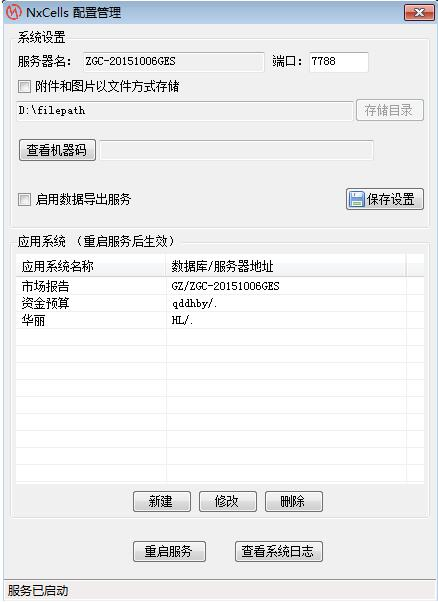
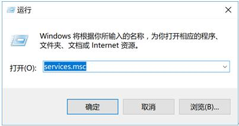
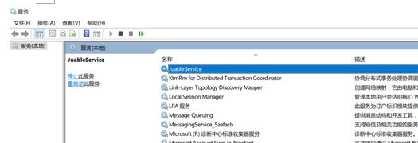
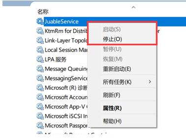
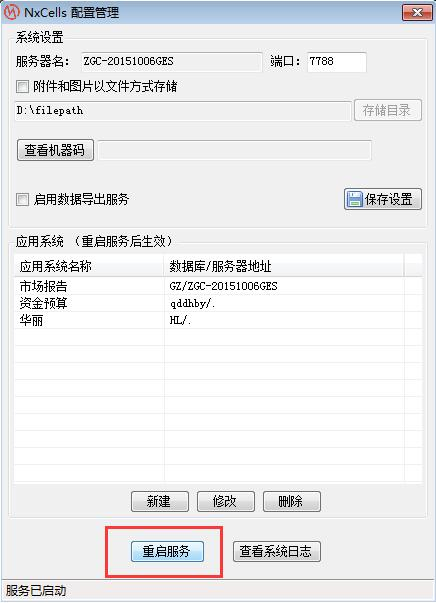
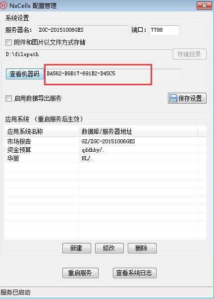
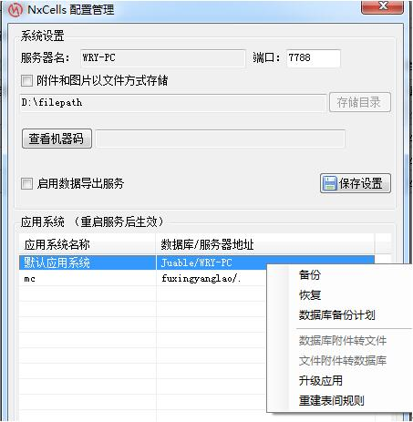
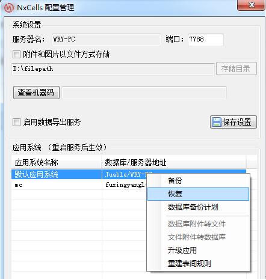
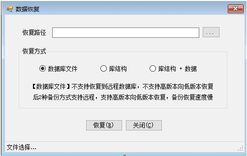

# 3.3 服务器配置基本操作
安装好NxCells之后，在服务端的“NxCells”菜单组中会有“NxCells服务器配置”菜单项。此模块用于设置系统运行的全局信息。
登录服务器配置

点击“开始—所有程序—NxCells—NxCells服务器配置”，出现服务器配置界面，如下图：
 

如果不想将文件和图片存储在数据库中，则勾选“附件和图片以文件方式存储”并设置号路径，点【保存设置】按钮。

## 3.3.1 应用系统
安装好NxCells后，我们就可以建立自己的“应用系统”。一个应用系统，实际上是一个数据库，有自己的一套组织机构、角色、人员、模板定义等。一台NxCells，可以同时管理多个应用系统，各个应用系统之间不直接共享数据。比如在一个企业中，有各种不同的职能，我们既可以建一个完整的大系统，其中包括财务、采购、销售、库存、人力资源管理等各个功能，也可以分别建成几个独立的小系统，如财务系统、物流系统等。

安装时，默认已经建立了一个应用，名为“默认应用系统”，如果安装时选择恢复示例数据库，则里面有NxCells功能点的讲解；否则，它是空的，里面没有内容。我们在后续章节中要学习的内容，就是如何向这个空的应用系统中增加内容，使它成为一个可用的系统。

建立和管理应用系统，在“NxCells设计器”模块中完成。

## 3.3.2 服务的启动与停止
1)	在安装服务端的时候，会安装上一个服务程序，名为“NxCellsService”，在服务器菜单运行中输入“services.msc”，如下图：
 

2)	点【确定】后，弹出服务窗口界面，找到“NxCellsService”，如下图：
 

3)	右键快捷菜单中选择“启用”或“停止”服务，如下图：
 

只有当这个服务启动的时候，客户端才能登录到系统，进行各种操作。

在服务端计算机的菜单【NxCells】-【NxCells服务器配置】界面，用【重启服务】来控制服务的启动和停止。如下图：

如果服务启动异常，可点【查看系统日志】查看异常原因及服务运行日志。

## 3.3.3 试用、延期试用、注册
从官网下载的NxCells安装包，有30天的试用期，带20个并发用户。所谓“并发用户”，指能够同时登录到服务器的用户数。打个比方，比如企业内有100个人，每个人座位上都有分机，但是只有5条外线，则同时只能有5个人向外打电话。并发用户数也是这个意思，你可以把企业内所有的机器都安装上客户端，但是只能有5个人同时登录服务器，第6个人若想登录，必须等到那5个人中有一个退出了，才可以登录。

如果在试用的过程中，想要试验更多的用户同时登录，或者希望延长试用期，可以向我们申请临时许可，申请的方法是：NxCells服务器配置界面，点【查看机器码】，将生成的机器码发送给我们客服，如下图”
 

将我们客服回复给您的“server.nks”，放在服务端计算机NxCells安装目录Server下（默认为：”D:\NxCells\server“），NxCells服务器配置界面重启服务即可。

## 3.3.4 数据库备份与恢复
### 3.3.4.1数据库备份
1）右击需要备份的账套，在弹出界面勾选【备份】

 
2）选择好【备份路径】和备【备份方式】后，点击备份即可。
 

备份的三种方式：

1.	数据库文件，该种备份备份的是整个数据库。一般适用于同种版本的数据库之间恢复或者低版本恢复到高版本，不适用于高版本向低版本恢复数据。

2.	库结构，该种备份备份的只是数据库的库结构，不备份数据。往往适用于在备份库修改数据结构后，恢复到正式库。

3.	库结构+数据，该种备份往往适用于高版本向低版本数据库恢复还原数据。

### 3.3.4.2数据库恢复
1）右击需要恢复的账套，在弹出界面点击【恢复】
 

2）选择好【回复路径】和【回复方式】后，点击恢复即可。
 

