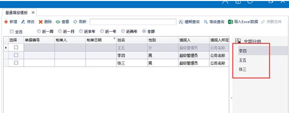
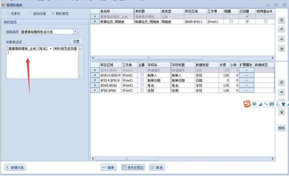
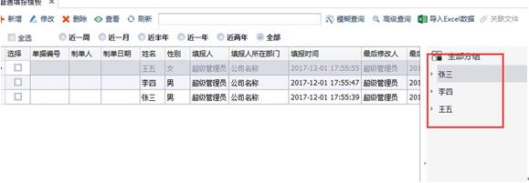

# 3.3 管理数据表
* 支持主表、明细表、交叉表，`主表唯一，不能设置多个主表`。

!> 注意：明细字段区域必须连续。

* 类型分普通表，临时表，映射表，可灵活切换。

!> 注意：修改`后台表`名称时要保持唯一性，`其他表`和`所有字段名`都不可与其相重复。

* 字段可以设置是否`存储`，不用再使用ES中的`UD`表

* 日期类字段可以设置扩展属性，选择是否显示`时间部分`

### 设置数据分类
> 聚表的模板数据分类与ES有所不同

##### 自动分组

点击自动分组后，在分组字段选择要分组的字段，选择排序方式和优先级，保存退出即可。例如按照姓名分类：
 

例如建立几个测试案例，客户端显示效果如下：
 

##### 树形规范

1.	类似上面自动分组构建树形规范。  
2.	绑定树形规范，设置筛选条件。  
 

3.	客户端展示效果  
 

