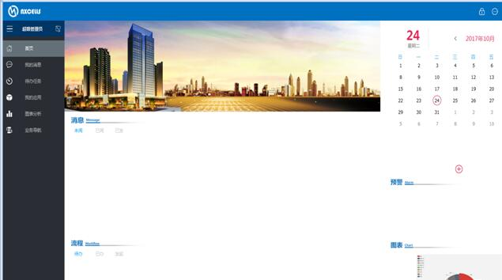
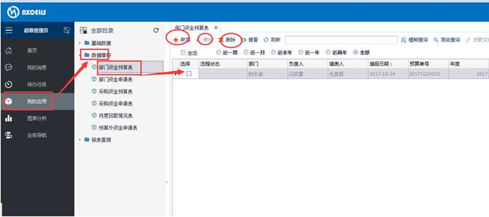
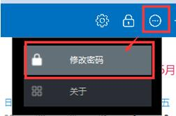
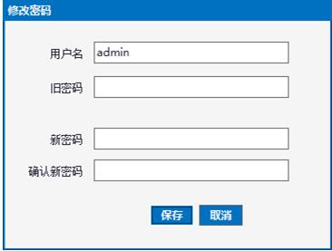

# 3.4 客户端基本操作
如前所述，在服务器配置中可以建立多个应用系统，在每个应用系统内的操作通过客户端模块完成。

## 3.4.1 客户端登录
登录到客户端有两种方式：

1)	双击点击桌面上的快捷方式“NxCells客户端”；

2)	点击【开始】-【程序】-【NxCells】-【NxCells客户端】；

无论采用上述哪种方式，都会打开下面的登录界面：
 

* 服务地址：需输入服务端计算机的”IP地址或域名”+”端口号”。如果服务器配置修改了默认端口号，此处端口号要与服务器端配置一致。如果就在服务端计算机上登录，可以直接默认值127.0.0.1:7788。

* 应用系统：这里需要选择应用系统名称，新安装的系统，有“默认应用系统“可供选择。如果没有应用系统可选择，则说明连接服务器异常。

* 用户名：任何应用系统中，都有一个自带的帐户admin，这个用户拥有最高的权限，这个帐户可以设置其他帐户。

* 密码：admin的默认密码是空，不用输入；待登录之后，您可以自己修改admin的密码。

该输入的信息都输入好了之后，点【登录】，完成登录。

## 3.4.2 客户端主界面
登录之后，进入到下图所示的客户端主界面。

界面的最上方是标题区，显示系统的名称（可以自定义），右上角是几个常用的菜单（设计器、锁屏、个人设置、退出等）；

界面左侧是功能菜单，包括“首页”、“我的消息”、“代办任务”、“我的应用”、“图表分析”、“业务导航“等。通过点击菜单的标签，可以进入一个菜单，进行具体的操作。

每个功能菜单展现内容不同，我们以“我的应用“举例：

“我的应用“功能下分左右两部分，左侧是分类树，右侧是列表区（我们称作”总表“）；

分类树显示该栏目中包含的信息的类别，在分类树节点上右击鼠标，会弹出菜单，其中包含的子菜单项为针对该类信息所能进行的操作；

列表区显示与分类树中当前选中节点所对应的具体信息。在列表区的上方有列表工具栏，其中的按钮为针对列表的当前行所能进行的常用【操作】；在列表当前行上右击鼠标，也能弹出右键菜单，其中包含的更多的【操作】。

在窗口的最下方是状态栏，显示当前登录的用户、登录的应用系统、当前时间等。
 

## 3.4.3 客户端各栏目功能概览
* 首页

此栏目包括最近未阅消息、代办流程、个人日程、预警信息、图表等。

* 我的消息

此栏目包括所有和我相关的未阅消息、已阅消息、已发消息。通过消息可以关联打开相关的表单。

* 代办任务

此栏目包括所有和我相关的代办流程、已办流程、发起流程。通过流程可以关联打开相关表单。

* 我的应用

用户在我的应用栏目中，进行模板数据的填报、查询等操作。根据用户权限的不同，每个用户在此能看到的内容也不尽相同。

* 业务导航

此栏目显示自定义的业务导航图，点击导航图标可以打开具体的表单。

## 3.4.4 更改密码
每个用户登录客户端后，都可以重新设置自己的密码，方法是：

1)	在客户端主界面标题区的右上角，选择菜单【个人设置】-【修改密码】，如下图：
 

2)	弹出如下图窗口，输入旧密码，两次输入新密码，点【保存】。
 

下次登录的时候，就需要输入新的口令才能登录。

## 3.4.5 关闭系统
点击客户端主窗口右上角的【关闭】，如下图：
  
