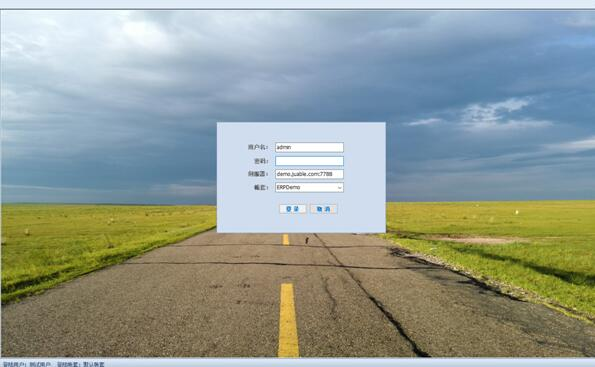
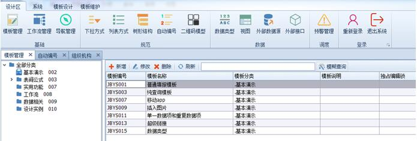

# 3.5 设计器基本操作
如前所述，在服务器配置中可以建立多个应用系统，在每个应用系统内的模板、流程、规则等通过设计器模块完成。只有系统默认几种角色“系统管理员”、“模板设计者”、“工作流设计者”、“部门管理员”才能登录设计器。

## 3.5.1 设计器登录
登录到设计器有两种方式：

1)	双击点击桌面上的快捷方式“NxCells设计器”；

2)	点击【开始】-【程序】-【NxCells】-【NxCells设计器】；

无论采用上述哪种方式，都会打开下面的登录界面：
 

* 服务地址：需输入服务端计算机的”IP地址或域名”+”端口号”。如果服务器配置修改了默认端口号，此处端口号要与服务器端配置一致。如果就在服务端计算机上登录，可以直接默认值127.0.0.1:7788。

* 应用系统：这里需要选择应用系统名称，新安装的系统，有“默认应用系统“可供选择。如果没有应用系统可选择，则说明连接服务器异常。

* 用户名：任何应用系统中，都有一个自带的帐户admin，这个用户拥有最高的权限，这个帐户可以设置其他帐户。

* 密码：admin的默认密码是空，不用输入。

该输入的信息都输入好了之后，点【登录】，完成登录。

## 3.5.2 设计端主界面
登录之后，进入到下图所示的客户端主界面。

