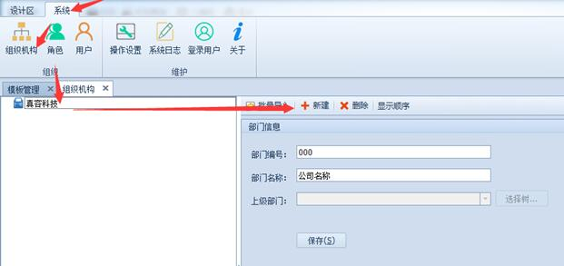

# 4.2 设置组织机构
## 4.2.1 设置公司信息
1) 【系统】（1）—【组织机构】（2）—右击【公司名称】（3）—【修改公司名称】（4），如下图：
 

2) 弹出窗口里，修改【公司名称】，保存即可，如下图：
 

## 4.2.2 建立部门
1)	【系统】（1）—【组织机构】（2）—左侧树形选择【部门】（3）—【新建】（4），如下图：
 

2)	输入【部门编号】、【部门名称】，然后选择【上级部门】，点【保存】按钮即可（支持多级部门的建立）。如下图：
 

如果我们要修改或者删除部门，可以通过上面的快捷按钮栏来进行操作。

注意：如果部门下建立了角色或者用户，需要把其删除才可以删除部门。

## 4.2.3 批量导入部门
如果觉得一个个输入部门太麻烦，我们可以事先把所有要输入的部门信息整理到一个Excel文件中，一次性导入。Excel文件按如下格式整理，其前三列的内容为部门编号、部门名称、上级部门编号。

如下图所示，我们现在看到的组织架构是：
 

现在我们就要把一个我们准备好的Excel表（表样如下图所示，格式一定要一致，否则可能导入错误），里面记录要导入的部门信息，假设在“测试部”下面加两个子部门“测试一部”、“测试二部”。
	 

部门信息的Excel文件整理好之后，就可以批量导入到系统，操作方法是：

1)	点击【批量导入】按钮

 
2)	弹出窗口，点【浏览】按钮事先整理好的部门信息Excel文件，然后点【检查数据合理性】按钮，检查无错误，即可点【导入】按钮
 

3)	部门导入完毕，点左侧树形“研发部”，下面多了两个刚才导入的部门。
 
