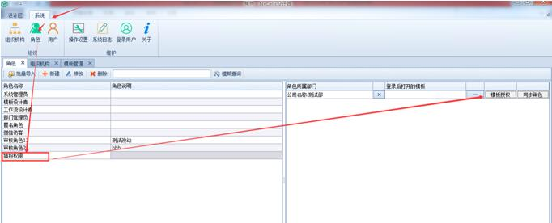

# 4.3 设置角色
## 4.3.1 角色的定义
角色就是职务、岗位的意思，比如说“总经理”、“销售经理”、“仓管员”、“财务”等，角色隶属于部门的，一个角色可以隶属于多个部门。

## 4.3.2 系统预定义角色
NxCells自带了四个角色。如下图：

* “系统管理员”：是本系统中权力最大的角色。我们一直用来登录的用户“admin”，就是此角色的成员。

* “模板设计者”：该角色的用户拥有设计模板的权限。

* “工作流设计者”：该角色的用户仅有可以设计工作流的权限。

* “部门管理员”:该角色权限比系统管理员的权限小很多，仅能管理本部门的用户设置及密码修改等。

## 4.3.3 建立角色
1)	【系统】（1）—【角色】（2）—【新建】（3），如下图：

2)	在弹出的窗口里，【角色名称】输入我们要创建的角色名称，然后勾选下面的【所属部门】，一个角色可以属于多个部门，比如：测试这个角色，根据需要勾选多个部门，点【保存】按钮即可；如果勾选【属于所有部门】，则系统自动在每个部门创建此角色，新增部门后也自动创建此角色，如下图：

3)	以测试这个角色举例，如果新增部门后需增加此角色，则查找到测试这个角色，然后点【修改】按钮，弹出窗口勾选部门“客服部”，点【保存】即可，如下图：

注意：如果有用户用到的角色，是不能直接进行删除的。

## 4.3.4 批量导入角色
如果觉得一个个输入角色太麻烦，我们可以事先把所有要输入的角色信息整理到一个Excel文件中，一次性导入。Excel文件按如下格式整理，只需一列角色名称。

角色信息的Excel文件整理好之后，就可以批量导入到系统，操作方法是：

1)	点击【批量导入】按钮

2)	弹出窗口，点【浏览】按钮事先整理好的角色信息Excel文件，然后点【检查数据合理性】按钮，检查无错误，即可点【导入】按钮

3)	角色导入完毕，下面多了两个刚才导入的角色，然后再去设置所属部门。

## 4.3.5 角色权限
NxCells的权限都过角色来实现的，角色绑定模板，然后勾选选择该角色对那些模板有增删改查的权限。用户在通过绑定角色，来确定该用户对哪些模板有增删改查的权限。下面，将会详细介绍如何将角色与模板绑定。
功能介绍：在此处设置角色操作模板的权限。

### 角色-表单填报权限
填报权限即为表单新增权限，只有有填报权限，才可以新增该模板表单。下面我以模板《权限演示》(关于如何建立一个模板，下个章节将会详细说明)为例，建立一个【填报权限】的角色，对该角色进行授权，使得该角色对《权限演示》只有填报/新增权限，不对其他权限进行授权。（特别注意：拥有新增权限的用户往往是允许看到自己填报的单据的，所以，拥有填报权限的角色往往也有一定的查阅权限）。

1)	【系统】（1）—【角色】（2）—选择角色【填报权限】（3）—【模板授权】（4），如下图：
 

2)	在弹出的窗口里，主要包含两部分，“填报权限”、查阅权限“，因为新增归类于填报权限 ，此处我们只展示填报权限，对查阅权限暂不说明。在“填报权限”找到需要绑定的《权限演示》模板，勾选；勾选后在右侧根据实际需求进行勾选权限操作，此处只展示填报权限。

勾选前：

勾选并授权后：
 

3)	 效果演示将在后续的用户绑定角色中进行展示。

### 角色-表单修改权限
修改权限分为：

* 无权限：对该模板对应的所有能查看的表单都没有修改权限；  
* 全部：对该模板对应的所有能查看的表单都有修改权限；  
* 本部门及下属部门：对该模板对应的所有能查看到的属于本部门以及下属部门填写的表单都有修改权限；  
* 本部门 : 对该模板对应的所有能查看到的属于本部门制单人填报的表单都有修改权限；  
* 本人：对该模 对应的所有能查看到的属于自己填报的表单都有修改权限；  
* 本人及下级：该模板对应的所有能查看到的属于人以及本人下属填写的表单都有修改权限；  
* 本人及上级：该模板对应的所有能查看到的属于人以及本人上级填写的表单都有修改权限；  

修改权限即为修改表单中的某条单据，只有有修改权限，才可以对表单进行修改。下面我以模板《权限演示》(关于如何建立一个模板，下个章节将会详细说明)为例，建立一个【修改权限】的角色，对该角色进行授权，使得该角色对《权限演示》只有修改权限，不对其他权限进行授权。（特别注意：若想修改某单据，必须对单据有查阅权限才可进行（即看到才可改），所以拥有修改权限的往往拥有一定范围的查阅权限）。

1)	【系统】（1）—【角色】（2）—选择角色【填报权限】（3）—【模板授权】（4），如下图：
 

2)	在弹出的窗口里，主要包含两部分，“填报权限”、查阅权限“，因为修改归类于填报权限，此处我们只展示填报权限，对查阅权限暂不说明。在“填报权限”找到需要绑定的《权限演示》模板，勾选；勾选后在右侧根据实际需求进行勾选权限操作，此处只展示填报权限。

勾选前：
 

勾选后：
 

3)	效果演示将在后续的用户绑定角色中进行展示。

### 角色-表单查阅权限
查阅权限分为：

* 无权限：对该模板对应的所有能查看的表单都没有查阅权限；  
* 全部：对该模板对应的所有能查看的表单都有查阅权限；  
* 本部门及下属部门：对该模板对应的所有能查看到的属于本部门以及下属部门填写的表单都有查阅权限；  
* 本部门 : 对该模板对应的所有能查看到的属于本部门制单人填报的表单都有查阅权限；  
* 本人：对该模 对应的所有能查看到的属于自己填报的表单都有查阅权限；  
* 报表内容：即根据报表的实际内容来限制权限，选择该权限，需要在后面的【高级查阅】输入筛选条件方可   
* 本人及下级：该模板对应的所有能查看到的属于人以及本人下属填写的表单都有查阅权限；  
* 本人及上级：该模板对应的所有能查看到的属于人以及本人上级填写的表单都有查阅权限；

查阅权限即为查看表单中的某条或者某些单据，只有拥有查阅权限，才可以对表单进行修改，删除等操作。下面我以模板《权限演示》(关于如何建立一个模板，下个章节将会详细说明)为例，建立一个【查阅权限】的角色，对该角色进行授权，使得该角色对《权限演示》只有查阅，不对其他权限进行授权。

1)	【系统】（1）—【角色】（2）—选择角色【查阅权限】（3）—【模板授权】（4），如下图：
 

2)	在弹出的窗口里，主要包含两部分，“填报权限”、查阅权限“，此处我们只展示查 阅权限，对填报权限暂不说明。在“查阅权限”找到需要绑定的《权限演示》模板，勾选；勾选后在右侧根据实际需求进行勾选权限操作，此处只展示查阅权限。

勾选前：
 

勾选后：
 

3)	效果演示将在后续的用户绑定角色中进行展示。

### 角色-表单删除权限
删除权限即为删除表单中的某条或者某些单据，只有有删除权限，才可以对表单进行删除操作。下面我以模板《权限演示》(关于如何建立一个模板，下个章节将会详细说明)为例，建立一个【删除权限】的角色，对该角色进行授权，使得该角色对《权限演示》只有删除权限，不对其他权限进行授权。（特别注意：若想删除某单据，必须对单据有查阅权限才可进行（即看到才可改），所以拥有修改权限的往往拥有一定范围的查阅权限）。

注意：在流程中的单据管理员可以有所有的删除权限；流程`第一步操作人`有流程在自己名下的删除权限。

1)	【系统】（1）—【角色】（2）—选择角色【删除权限】（3）—【模板授权】（4），如下图：
 

2)	在弹出的窗口里，主要包含两部分，“填报权限”、查阅权限“，因为删除归类于填报权限，此处我们只展示填报权限，对查阅权限暂不说明。在“填报权限”找到需要绑定的《权限演示》模板，勾选；勾选后在右侧根据实际需求进行勾选权限操作，此处只展示填报权限。
勾选前：
 

勾选后：

 
3)	效果演示将在后续的用户绑定角色中进行展示。

### 其他权限
例如导出，导出，打印，审核，作废等，如字面意思，授权操作与上诉相同。主要又分为两种操作方式，即填报时和查阅时。

## 4.3.6 登录后打开的模板
登录后打开的模板即当用户成功登录客户端后，无需进行任何操作即可打开一张表单以供用户来填报。以【填报权限】角色为例，使该角色绑定的用户登录成功后即可打开《权限演示》模板。

1)	【系统】（1）—【角色】（2）—选择角色【填报权限】（3）—【登录后打开的模板】（4），如下图：
 

2)	打开后选择《演示模板》，然后点击确定
 

3)	绑定成功后如下：

