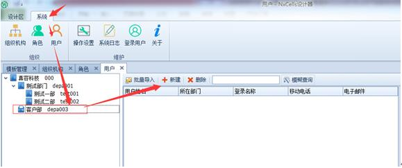
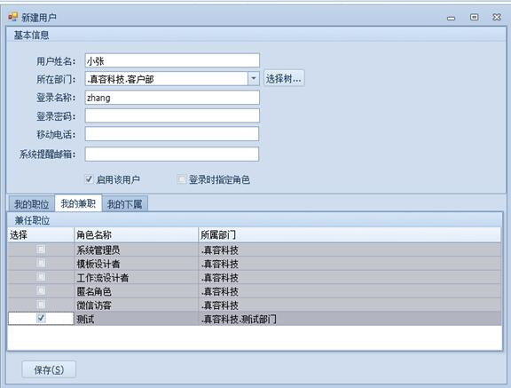
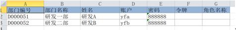
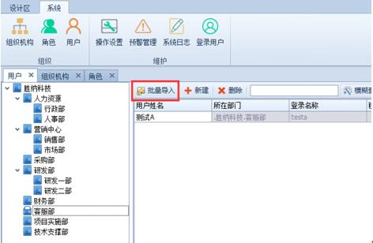
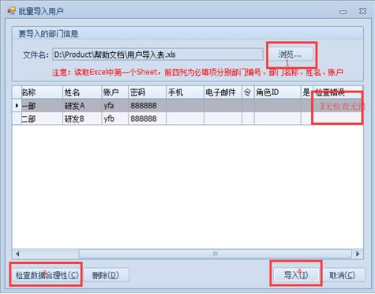

# 4.4 设置用户
NxCells中的用户就是一个登录名称。初始只有一个用户，就是admin，初始密码为空。admin用户拥有系统管理员的角色权限，可以建立其他的用户，并且对他们赋予权限。

## 4.4.1	建立用户
建立四个用户，用户名登录名分别为【填报用户】【修改用户】【查阅用户】【删除用户】，密码为空，分别绑定上诉建立的【填报权限】【修改权限】【查阅权限】【删除权限】四个角色。

1)	【系统设置】（1）—【用户】（2）—左侧树形选择【部门】（3）—【新建】（4），如下图：
 

2)	在弹出的窗口里，主要包含三部分，“基本信息”、“本部门职位”、“兼职职位”，

3)	“基本信息“里，需要输入【用户姓名】【所在部门】【登录名称】【登录密码】4个重要字段信息，

4)	“本部门职位”里勾选对应的角色
，
5)	如果有兼职其他部门的职位，则在“我的兼职”选择其他部门的角色，点【保存】即可。如下图：
 

## 4.4.2 批量导入用户
批量建立用户的方法和批量建立部门类似，首先，把所有用户的信息整理好，输入到一个Excel文件的第1个sheet中，共5列，分别是：部门编号、部门名称、姓名、账户、密码等。
	 

用户信息的Excel文件整理好之后，就可以批量导入到系统，操作方法是：

1)	点击【批量导入】按钮
 

2)	弹出窗口，点【浏览】按钮事先整理好的用户信息Excel文件，然后点【检查数据合理性】按钮，检查无错误，即可点【导入】按钮
 

3)	用户导入完毕，点左侧树形“研发部”，下面多了两个刚才导入的用户。