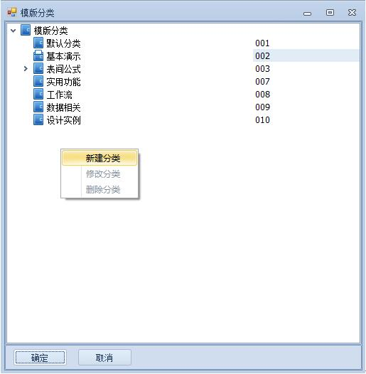
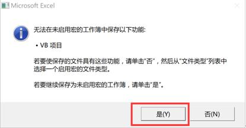
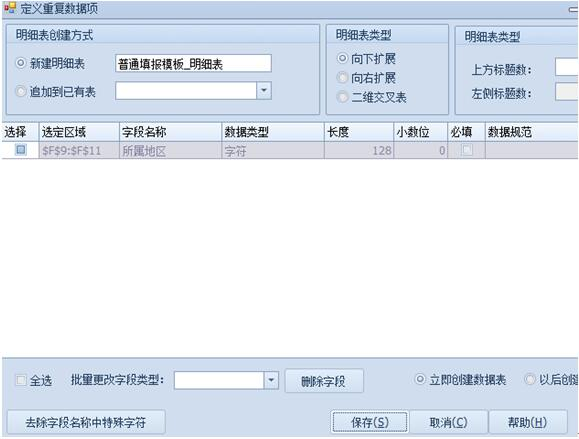

# 5.1 新建模板
此章节通过创建一个简单的模板来熟悉模板的概念、建立过程、授权等，比如《费用报销单》模板。您将学会：
* 建立新模板  
* 设置模板权限  
* 数据项的概念，如何在模板上定义单一数据项、重复数据项  
* 应用设计好的模板录入数据，以及修改、删除和查看数据。  
* 设置模板的高级查阅权限  
* 定义数据填写规范  
* 设置主键，保证数据的唯一性

【设计区】（1）—【模板管理】（2）—【新建】（3），如下图：
 

## 5.1.1	第一步、模板信息
1)	设置模板基本信息及高级属性
	 

* 基本信息
【模板编号】必填，唯一，用于模板先后次序排序。  
【模板名称】必填，唯一，用于逻辑关系引用。  
【模板标题】，用于手机端表名显示。  
【模板分类】弹出窗口选择（如果没有，则树形中选中某分类，右键快捷菜单新增或修改分类），如下图：
 

用于我的应用中左侧树形目录。

【手机分类】弹出窗口选择（如果没有，任意位置右键快捷菜单新增），如下图：
 

应用于手机端，不支持多级。

* 高级属性

高级属性可根据实际需要设置，在此不做详细说明；【打开方式】选择spreadsheet运行时速度会更快，推荐这个设置。

2)	模板信息设置完毕后，点【下一步】按钮，选择要创建的表类型；

 
一般默认选择【自动创建表】。打开一张空白的Excel模板，然后点保存。

?> 拓展延伸：映射表，即相当于另一个表的映射。甲表映射乙表。甲表的A,B,C三个字段分别映射乙表的Q,W,E字段，那么甲表A,B,C的显示结果既是乙表的Q,W,E。可自行测试。

## 5.1.2 第二步、画出Excel表样 
画Excel表样，我们提供二种方法：

	方法一：

如果没有Excel表样，则直接画出表样，然后保存即可。

	方法二：

1)	如果已有Excel表样，先保存，然后【加载项】-【关闭】，弹出模板保存窗口，点【保存】按钮，退出模板设计状态，如下图：

2)	选中《普通填报模板》模板，右键快捷菜单中点【导入Excel文件】，如下图：
 

3)	弹出选择文件窗口，选择普通填报模板，点【打开】按钮，如下图
 

4)	弹出确认提示，点【是（Y）】，如下图：
 

5)	弹出确认，点【是（Y）】，如下图：
 

6)	点【继续】按钮，如下图：
 

7)	提示导入成功。如下图：
 

8)	双击《普通填报模板》，打开刚刚导入的Excel文件。如下图（简单的只有三个字段）：
 

## 5.1.3 第三步、定义表与数据项（管理数据表）
* 模板里的表可分为主表、明细表、交叉表。

1)	“主表“指分布在各个位置不是连续区域字段组成的表，即上图所示的【分类编码】【分类名称】等字段组成的表，一个模板只能有一个主表。

2)	“明细表“指可向下或向右扩展连续区域字段组成的表，一个模板可以有多个明细表。

3)	“交叉表“指即可向下扩展又可向右扩展连续区域字段组成的表，一个模板可以有多个明细表。

* 一个模板可以由1个主表+N个明细表+N个交叉表组成，系统默认会创建一个主表。

* 主表里字段称为“单一数据项“，明细表里字段称为“重复数据项“。

### 5.1.3.1	定义单一数据项
#### 5.1.3.1.1 新建单一数据项
在《普通填报模板》模板上，我们需要定义单一数据项。

1)	在《普通填报》模板的设计状态下，先选择单据日期后面的单元格，再按住Ctrl键后选择其他需要定义为单一数据项的单元格，选择完毕后，点上方菜单栏【定义单一数据项】或右键快捷菜单里【定义单一数据项】，如下图：
 

2)	弹出“定义单一数据项“界面，如下图：
 

3)	点【去除字段名字中的特殊字符】，根据需要修改【字段名称】、【数据类型】、【长度】、【小数位】等，修改完毕点【保存】按钮，主表与单一数据项创建成功。如下图：
 

点菜单栏【管理数据表】按钮即可查看刚刚创建的表与字段，如下图：
 

通过管理数据表，我们可以设置表与字段的很多属性，我们将会在后面章节说明。

#### 5.1.3.1.2 追加单一数据项
1)	在《普通填报模板》模板的设计状态下，选择需要追加的字段区域等，点上方菜单栏【定义单一数据项】或右键快捷菜单里【定义单一数据项】，如下图（例如追加姓名和性别这两个字段）：
 

2)	弹出“定义单一数据项“界面，如下图：
 

3)	点【去除字段名字中的特殊字符】，根据需要修改【字段名称】、【数据类型】、【长度】、【小数位】等，修改完毕点【保存】按钮，单一数据项追加成功。如下图：
 

### 5.1.3.2	定义重复数据项
#### 5.1.3.2.1 新建重复数据项
1)	在《普通填报模板》模板的设计状态下，定义明细表区域，选中的区域必须连在一起，选择完毕后，点上方菜单栏【定义重复数据项】或右键快捷菜单里【定义重复数据项】，如下图（在普通填报模板下增加明细表来存储该人的教育经历）：
 

2)	弹出“定义重复数据项“界面，如下图：
 

3)	修改表名可默认，【明细表类型】选择向下扩展，点【去除字段名字中的特殊字符】，根据需要修改【字段名称】、【数据类型】、【长度】、【小数位】等，修改完毕点【保存】按钮，明细表与重复数据项创建成功。如下图：
 

点菜单栏【管理数据表】按钮即可查看刚刚创建的表与字段，如下图：
 
  

通过管理数据表，我们可以设置表与字段的很多属性，我们将会在后面章节说明。

#### 5.1.3.2.2 追加重复数据项
1)	在《普通填报模板》模板的设计状态下，选择需要追加的字段区域，比如：插入一列F9:F11来存储该学校所在的地区，插入完成后保存一下模板，如下图：
 

2)	选中明细表区域F9:F11，点上方菜单栏【定义重复数据项】或右键快捷菜单里【定义重复数据项】，如下图：
 

3)	弹出“定义重复数据项“界面，如下图：
 

4)	【明细表创建方式】选择追加到已有表“教育经历_明细表“，点【去除字段名字中的特殊字符】，根据需要修改【字段名称】、【数据类型】、【长度】、【小数位】等，修改完毕点【保存】按钮，重复数据项追加成功。如下图：
 

### 5.1.3.3	管理数据表
在《普通填报模板》模板的设计状态下，点上方菜单栏【管理数据表】或任意单元格右键快捷菜单里【管理数据表】，如下图：
 
  
 

#### 5.1.3.3.1 设置表
 
 
* 【表名称】可改但必须此数据库内唯一。  
* 【表标题】用于手机端应用表名显示。  
* 【隐藏】勾选，则总表界面看不到此表。  
* 【相同值合并】勾选，则明细表某字段上下内容一致时会合并在一起。  
* 【Excel公式批处理】勾选，则明细表内第一行写的Excel公式会向下或向右复制，可提高运行效率。  
* 【手机列表样式】勾选，则手机上明细表按列表式显示，否则按卡片式显示。  
* 【主键重复提示】勾选，则如果表字段设置了主键，保存报表时显示此提示。

#### 5.1.3.3.2 设置字段
以主表字段为例
 

* 【所在区域】可改，如果是明细表，则行号必须一致，且区域连续。  
* 【主键】勾选，则数据库此表里此内容唯一，可选多个字段。如果保存报表时重复会有提示信息，如下图：
 

* 【字段名】可改但必须此表内唯一。  
* 【字段标题】用户手机端字段标题显示。  
* 【数据类型】可由“ 小数”改”字符“，其他类型不可改。  
* 【长度】用于设置【数据类型】为“小数”或“字符”时字段长度。  
* 【小数】用于设置【数据类型】为“小数”时字段小数位长度。  
* 【扩展属性】用于设置各【数据类型】的扩展属性，如为“日期”，则可隐藏日期控件或去除时间戳。  
* 【数据规范】用于关联定义的数据规范。设置”数据规范“会在数据规范章节说明。  
* 【必填】勾选，则如果为空，保存报表时显示此字段必填提示，保存不成功，如下图：
 

* 【隐藏】勾选，则总表界面、手机端表单界面看不到此字段。  
* 【可编辑】勾选，则填报报表时可编辑此字段。  
* 【不清空】勾选，则连续填报下一张报表时不清空此字段。  
* 【排序】可选择升序或降序，如选择降序，则总表界面按此字段降序显示，可设置多个字段的升降序。  
* 【手机填报】勾选，则手机端表单填报界面显示此字段。  
* 【手机摘要】勾选，则手机总表界面显示此字段。  
* 【本表唯一】勾选，则本表的明细表内此字段不可重复，可多选组合。  
* 【验证必填提示】与【必填】配合使用，保存报表时显示提示内容，保存不成功。  
* 【相同值合并】主表勾选，则明细表某字段上下内容一致时会合并在一起。  
* 【合并优先级】勾选且主表【相同值合并】勾选，则按优先级明细表字段上下内容一致时会合并在一起。

#### 5.1.3.3.3 设置数据分类

1）	自动分组

点击自动分组后，在分组字段选择要分组的字段，选择排序方式和优先级，保存退出即可。例如按照姓名分类：
 

例如建立几个测试案例，客户端显示效果如下：
 

2）	树形规范

1.	参照6.1.4构建树形规范。  
2.	绑定树形规范，设置筛选条件。  
 

3.	客户端展示效果  
 

#### 5.1.3.3.4 自定义数据类型
【NxCells设计器】->【数据类型】
 

打开界面如下：
根据业务实际需要，增加/修改/删除数据类型
 
5.1.3.3.5自定义后台字段名
注意：此处没有特殊情况，不建议自行修改后台字段名。特别需要注意的是，表名称的后台字段名要保持唯一性，即其他表和所有字段名都不可与其相重复。
1)	建表时自定义后台字段名
 
2)	创建后自定义字段名
授权：在【模板属性】勾上【允许修改后台表字段名】。
 
进入【管理数据表】修改后台字段名。
5.1.4	第四步、设置模板权限
1)	模板管理界面，可通过点上方菜单【权限设置】按钮或选中某模板名称右键快捷菜单里，点【模板权限】按钮，进入模板权限设置界面，如下图：
 
如果是模板设计状态下，点菜单栏【模板权限】按钮
 
2)	进入模板设计界面-填报权限，如下图：
 	
3)	点【+】按钮，进入添加角色界面，选择需要的角色，点【确定】按钮，返回填报权限界面，如下图：
 
4)	根据不同角色设置修改与删除权限的授权范围，此处设置到本人，就是指只能修改或删除本人填报的报表，如下图：
 
5)	进入查阅权限，如下图：
 	
6)	点【+】按钮，进入添加角色界面，选择需要的角色，点【确定】按钮，返回查阅权限界面，如下图：
 
7)	根据不同角色设置相应查阅权限的授权范围，【本人】就是指只能查阅本人填报的报表，如下图：
 
8)	点【保存】按钮，模板权限设置完毕。
权限授权范围主要有：
* “无权限“指可查阅不到任何用户填写的表单。
* “全部“指可查阅所有用户填写的表单。
* “本部门及下属部门“指可查阅本部门及下属部门用户填写的表单。
* “本部门“指可查阅本部门用户填写的表单，不含下属部门用户。
* “本人“指可查阅本用户填写的表单。
* “报表内容“指可根据模板主表的字段内容与当前用户姓名、当前用户登录名、当前用户角色、当前用户角色所在部门名称、当前用户角色所在部门编号、当前用户所在部门、当前用户兼职部门、当前用户部门编号、当前用户所在兼职部门编号等做判断。
5.1.5	设置模板状态
模板有两种状态：停用与启用。
模板停用：
以《普通填报模板》为例：【模板设计】->【普通填报模板】->右击，在弹出界面选择【模板停用】。
 
模板启用：以刚刚停用的《普通填报模板》为例：【模板设计】->【普通填报模板】->右击，在弹出界面选择【模板启用】。
 
