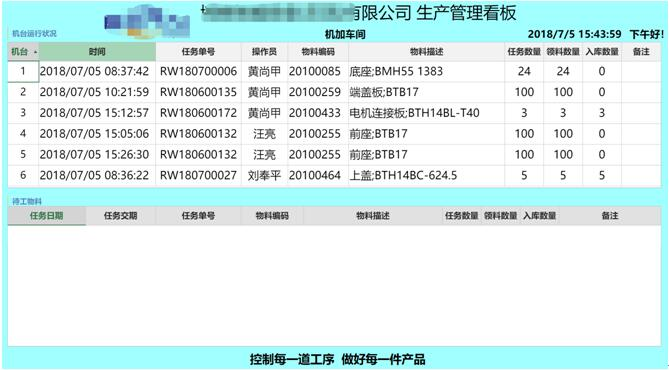

# 6.1 看板简易教程

1、先来看看效果，表格内容自动刷新，我设置的是每20秒刷一次表格数据



2、表格数据全来自NX开发的ERP系统


3、重点来了，安装HZG，使用设计器设计页面，设计好你的表格，绑定NX数据库里的表添加NX数据库


* 绑定NX的的数据源


* 时间刷新JS如下，定时刷新插件装一下，插件已上传到群里了。

```
setInterval(refresh,200);
function refresh(){
    Forguncy.Page.getCell("time").setValue(new Date());
}
```


* 页面加载里面发布即可


4、接下来是设置电视机，最好WIN  因为要装chrome  并且使用全屏模式
全屏模式方法如下

快捷方式-右键属性-目标后面加  `--kiosk http://你的访问地址/`   注意空格


将这个快件方式设置开机启动即可
